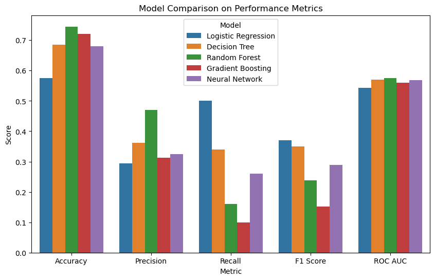
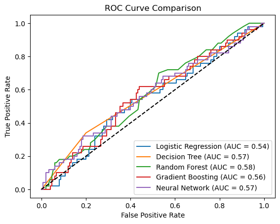
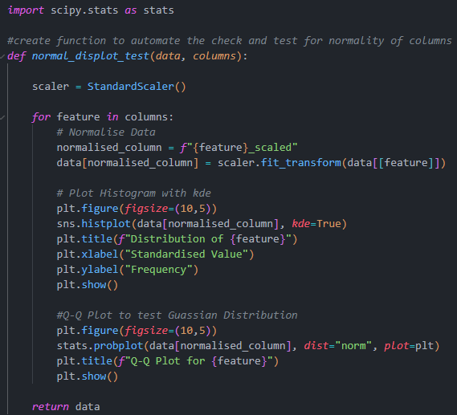
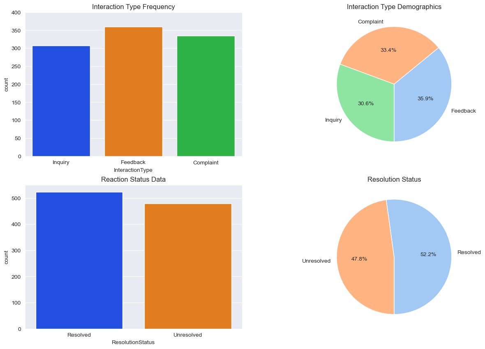
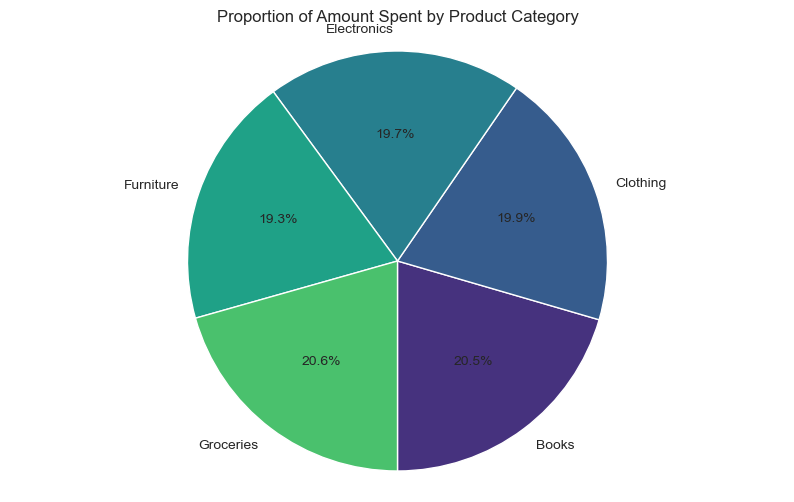
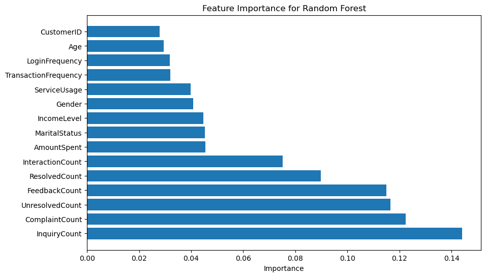

# Lloyds Banking Group Data Science Job Simulation - October 2024

## Project Overview

This repository contains the work completed for the job simulation involving customer churn prediction for the Data Science & Analytics team at Lloyds Banking Group. The objective of the project was to develop a predictive model that identifies customers at risk of churning, enabling the business to implement effective retention strategies.

## Key Highlights

- Developed and implemented a predictive model using **Random Forest** and other machine learning algorithms, achieving an **F1 score of 0.862**.
- Conducted advanced data preprocessing, including:
  - Handling missing values
  - Encoding categorical variables
  - Feature scaling
- Utilised Python libraries such as **pandas**, **scikit-learn**, and **matplotlib** for data manipulation, model building, and visualisation.
- Performed comprehensive model evaluation and tuning by:
  - Optimising hyperparameters with **GridSearchCV**
  - Analysing feature importance to derive actionable business insights.
### Results
The final model achieved an F1 score of 0.862, indicating a strong ability to balance precision and recall in predicting customer churn.
Key features impacting churn prediction were identified, providing actionable insights for customer retention strategies.
### Future Work
Explore additional modeling techniques (e.g., ensemble methods or neural networks) for potentially improved performance.
Continuously update the model with new data to enhance accuracy and adapt to changing customer behaviors.
Develop an interactive dashboard for real-time monitoring and decision-making based on churn predictions.
## Acknowledgments
Thank you to Lloyds Banking Group and Forage for the opportunity to participate in this job simulation and enhance my skills in data science and analytics.
## Project Structure

### EDA file
Data Inspection
  - Variable Analysis
Exploratory Data Analysis
  Datasets:
  - Customer Demogrpahics
  - Transactional History
  - Customer Service
  - Online Activity
Data Cleaning
- Check Null Values
- Handle Missing Values
- Merge Datasets
- Further EDA on new columns
- Statiscal Analysis testing 

### Modelling
Final Inspection on cleaned data
- Statistical Analysis on features to determine  standardisation, normalisation methods for feature engineering
- Q-Q test to analyse normality of features
Feature Engineering
- Encoding using Onehot, Ordinal Encoder
- Scaling using StandardScaler
- Transformation (log)
- Preproccessing & building pipelines
Modelling
- Split into Train & Test
- SMOTE on imbalanced data
- Fit & Compare Models (logistic regression, decision trees, random forest, gradient boosting, neural network
Model Metrics (accuracy, precision, ROC-AUC, recall, f1-score
Hyperparameter Testing (f1 score of random forest increased from 0.24 to 0.862 using GridSearchCV)

## Highlighted Visulaisations 

